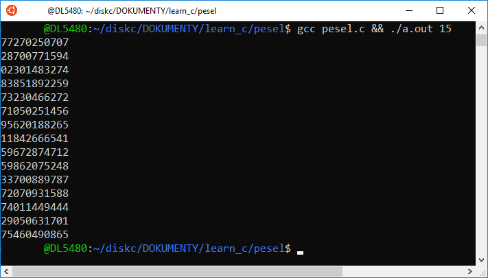

## Generator PESEL
Generator numerów Powszechnego Elektronicznego Systemu Ewidencji Ludności.
Więcej na [wikipedii](https://pl.wikipedia.org/wiki/PESEL)

## Podgląd


## Uruchamianie
```
gcc pesel.c && ./a.out 15
```
Jako parametr należy podać ilość potrzebnych numerów PESEL do wygnerowania